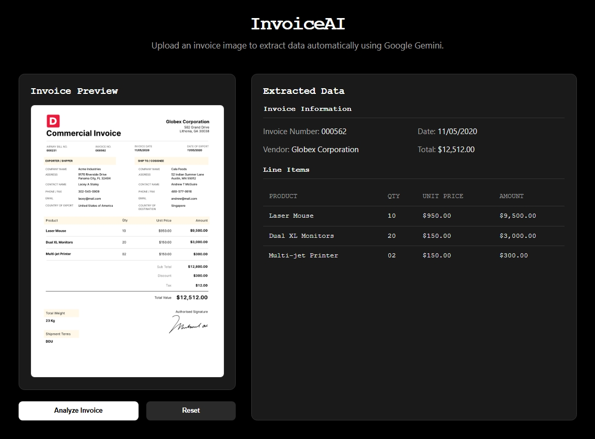

# InvoiceAI 📄✨

InvoiceAI is a modern web application that showcases the power of Large Language Models for intelligent document processing. By leveraging the multimodal capabilities of **Google's Gemini LLM**, it can analyze any invoice image, understand its unique structure, and dynamically extract its data in a structured format.

The application features a minimalist, retro black-and-white theme and is designed to demonstrate how a sophisticated AI prompt can create a flexible and adaptive data extraction tool.



---

## 🤖 The AI Core: Dynamic Extraction with Gemini

The intelligence of this application lies in its direct and sophisticated use of the Google Gemini LLM. Unlike rigid template-based systems, InvoiceAI sends the invoice image directly to the model and uses a powerful prompting strategy to perform a complex analysis in a single step.

This approach allows the AI to adapt to a wide variety of invoice layouts from simple receipts to complex commercial invoices—without being constrained by predefined categories.

### How the Extraction Process Works

1.  **Image Analysis:** When an image is uploaded, it is converted to a base64 string and sent to the Gemini API. The LLM's multimodal capabilities allow it to visually analyze the layout, text, and structure of the document.

2.  **Sophisticated Prompting:** The core of the process is a detailed prompt that guides the LLM's analysis. The prompt instructs the model to act as an expert data extractor and perform the following tasks:
    * **Extract Top-Level Information:** Identify general invoice data like Invoice Number, Date, Vendor Name, and any final totals. This data is structured into an `invoiceInfo` object.
    * **Identify the Main Table:** Scan the document to locate the primary table containing line items.
    * **Dynamically Extract Headers:** Critically, the model is instructed to identify and extract the *exact column headers* from the table (e.g., "Product", "Qty", "Unit Price", "Amount"). This is the key to the app's adaptability.
    * **Extract Row Data:** The model then processes each row in the table, ensuring the extracted values align with the dynamic headers it just identified.

3.  **Flexible JSON Output:** The AI is strictly instructed to format its entire output into a single, predictable JSON object. This object contains the top-level `invoiceInfo` and a `lineItems` object, which itself holds the dynamic `headers` and `rows` arrays.

    ```json
    {
      "invoiceInfo": {
        "Invoice_Number": "INV-000562",
        "Date": "11/05/2020",
        "Total_Value": "$12,512.00"
      },
      "lineItems": {
        "headers": ["Product", "Qty", "Unit Price", "Amount"],
        "rows": [
          ["Laser Mouse", "10", "$950.00", "$9,500.00"],
          ["Dual XL Monitors", "20", "$150.00", "$3,000.00"],
          ["Multi-jet Printer", "02", "$150.00", "$300.00"]
        ]
      }
    }
    ```

4.  **Dynamic Frontend Rendering:** A specialized `DynamicRenderer` component in the React frontend receives this JSON. It reads the `headers` array to build the table's header row and then iterates over the `rows` array to populate the table. This ensures that the displayed output is always a perfect representation of the input invoice's structure.

---

## 🛠️ Tech Stack

* **AI Model:** [Google Gemini API](https://ai.google.dev/) (`gemini-2.0-flash`)
* **Frontend:** [React.js](https://reactjs.org/) (bootstrapped with [Vite](https://vitejs.dev/))
* **File Uploads:** [React Dropzone](https://react-dropzone.js.org/)
* **Styling:** Manual CSS

---

## ⚙️ Getting Started

### Prerequisites

* [Node.js](https://nodejs.org/) (v18 or later)
* A **Google AI API Key**. Get a free key from [Google AI Studio](https://aistudio.google.com/app/apikey).

### Installation & Setup

1.  **Clone the repository:**
    ```bash
    git clone [https://github.com/your-username/invoice-ai.git](https://github.com/your-username/invoice-ai.git)
    cd invoice-ai
    ```

2.  **Install dependencies:**
    ```bash
    npm install
    ```

3.  **Configure Environment Variables:**
    * Create a new file in the root of the project named `.env.local`.
    * Add your API key to this file (Vite requires the `VITE_` prefix):
        ```
        VITE_GEMINI_API_KEY=YOUR_GOOGLE_AI_API_KEY_HERE
        ```
    * Update `src/App.jsx` to use this variable:
        ```javascript
        const GEMINI_API_KEY = import.meta.env.VITE_GEMINI_API_KEY;
        ```

4.  **Run the app:**
    ```bash
    npm run dev
    ```

### Deploying to Vercel

1.  Go to your project's settings in Vercel.
2.  Navigate to the **Environment Variables** section.
3.  Add a new variable:
    * **Name:** `VITE_GEMINI_API_KEY`
    * **Value:** Paste your Google AI API key.
4.  Redeploy your project.
